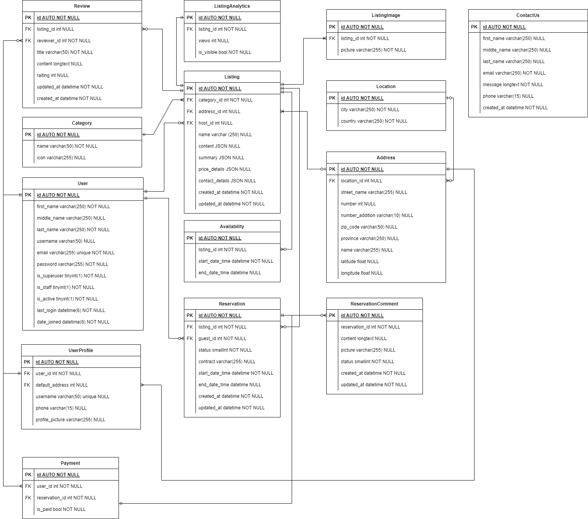

# IRentalize

## Description

IRentalize is a web application that allows users to rent out their items to other users.
The application is closely related to the popular website Airbnb, but instead of renting out *only* houses, users can
rent out different other items.

## ERD - Entity Relationship Diagram

***Note:*** *The ERD is not final and will be updated in the future.*


## Installation

### Prerequisites

- [Node.js](https://nodejs.org/en/)
- [MySQL](https://www.mysql.com/)
- [Python](https://www.python.org/) - version 3.8 or higher
- [pip](https://pip.pypa.io/en/stable/) - should be pre-installed with Python

### Setup

1. Clone the repository
    - `git clone https://github.com/Geniools/IRentalize.git`
2. Install the dependencies
    - `pip install -r requirements.txt`
    - `cd src/frontend` and then `npm install`

### Configuration

- Clone the repository
- Install the dependencies

```bash
pip install -r requirements.txt
```

- Create a `local_settings.py` file in the `IRentalize_student` folder. Use the `example_local_settings.py` file as a
  template.

- Run the migrations

```bash
python manage.py migrate
```

- Create a superuser account:

```
python manage.py createsuperuser
```

- (In Production) Collect the static files **make sure to have changed the correct directory in django settings**

```bash
python manage.py collectstatic
```

- Create an ``.env`` file in the ``src/frontend`` folder and add the following text:

```dotenv
REACT_APP_GOOGLE_MAPS_API_KEY=your-api-key
REACT_APP_GOOGLE_ADDRESS_API_KEY=your-api-key
GOOGLE_RECAPTCHA_KEY=your-api-key
```

- Run the following command to start the frontend development server:

```
cd src/frontend 
npm run dev
```

*Note:* For production, run `npm run build` instead!

- Run the server

```bash
python manage.py runserver
```

## Usage

- The admin panel can be accessed at `http://localhost:8000/admin/` (or whatever port you are running the server on)
- The frontend can be accessed at `http://localhost:8000/` (or whatever port you are running the frontend development
  server on)
- The API can be accessed at `http://localhost:8000/api/` (or whatever port you are running the server on)
- The submodule "student-finance" can be accessed at `http://student.localhost:8000/` (or whatever port you are running
  the server on)